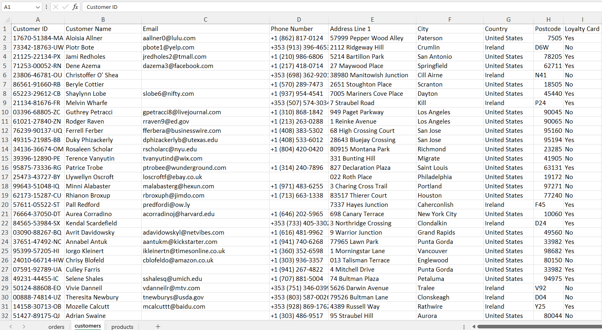
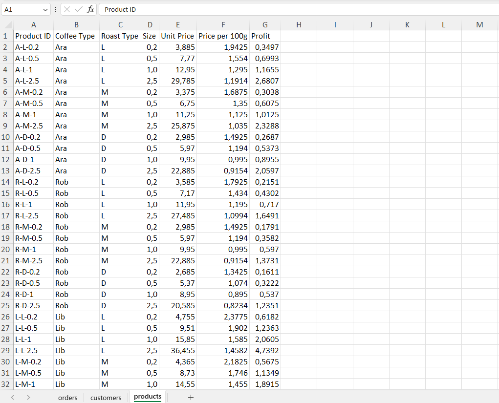
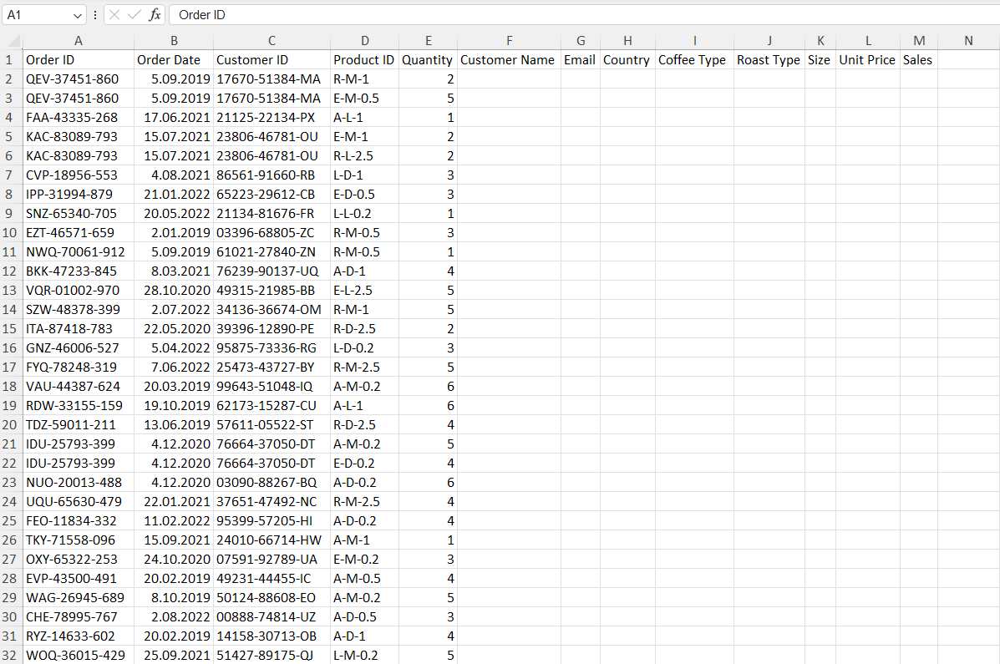
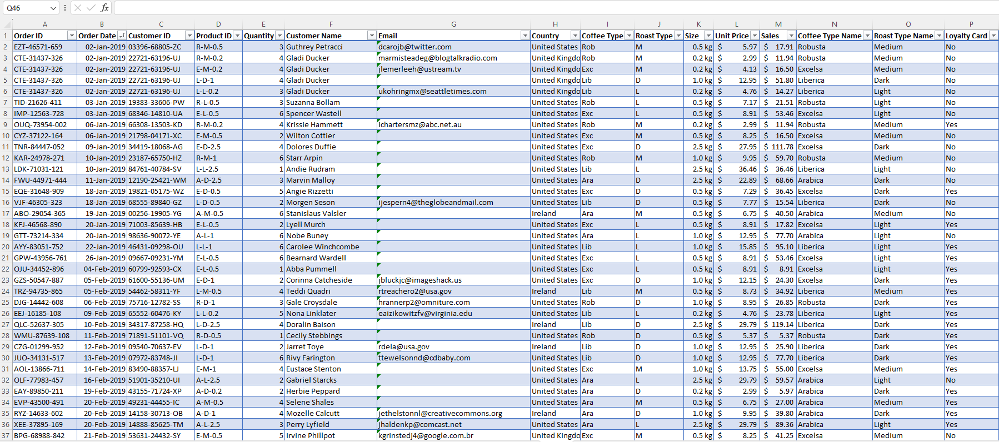
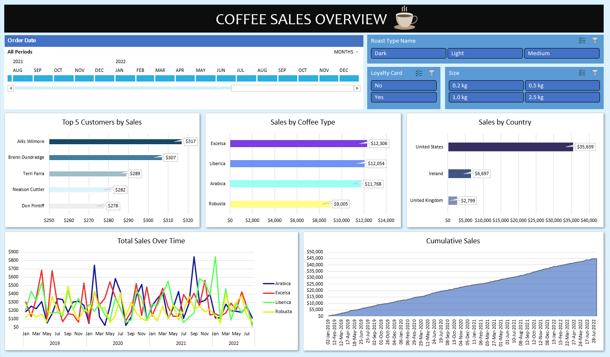

# Coffee Sales Analysis

 
 

## Introduction
This project was focused on coffee sales, using **MS Excel** for detailed analysis. The main goal was to find useful insights to assist decision maker to make strategic decisions. By exploring data, the aim was to uncover patterns and trends, providing valuable information for managing the complexities of the coffee data. The project is designed to offer straightfoward, actionable intelligence for a more data-driven approach in managing coffee sales.
 
 

## Problem Statement

* Which of our customers rank in the top 5 in terms of sales ?

* How are sales distributed among different coffee types ?

* Which countries exhibit notable sales patterns ?

* How does total sales vary over time by coffee type ?

* How is the cumulative sales over time ?
 

## Skills & Features Demonstrated in MS Excel:

- IF()

- XLOOKUP()

- INDEX()

- MATCH()

- Pivot Table

- Pivot Charts

- Filters

- Slicers
 

## Data Transforming & Cleaning
Below, you can see the initial state of the sheets.
 
 

**Customer Sheet:**
 

 
 

**Product Sheet:**
 

 
 

**Order Sheet:**
 

 
 

As evident, there are missing values in the orders sheets. We need to populate these cell with the necessary data to conduct a more comprehensive analysis of coffee sales. Nevertheless, the missing values can be retrieved from other sheets through Excel formulas. Below, you can find the Excel formulas applied to populate the empty columns, and generate new ones.
 

---

**UPDATED COLUMNS**
 
 

*Customer Name*:

=XLOOKUP(C2,customers!$A$1:$A$1001,customers!$B$1:$B$1001,,0)
 
 

*Email*:

=IF(XLOOKUP(orders!C10,customers!$A$1:$A$1001,customers!C9:C1009,,0)=0,"",XLOOKUP(orders!C10,customers!$A$1:$A$1001,customers!C9:C1009,,0))
 
 

*Country*:

=XLOOKUP([@[Customer ID]],customers!$A$1:$A$1001,customers!$G$1:$G$1001,,0)
 
 

*All Columns Regarding Product Sheet (Coffe Type, Roast Type, Size, Unit Price)*

=INDEX(products!$A$1:$G$49,MATCH($D2,products!$A$1:$A$49,0),MATCH(I$1,products!$A$1:$G$1,0))
 

---

**NEW COLUMNS**
 
 

*Sales:*

=L2*E2
 
 

*Coffe Type Names:*

=IF(I2="Rob","Robusta",IF(I2="Exc","Excelsa",IF(I2="Ara","Arabica",IF(I2="Lib","Liberica",""))))
 
 

*Roast Type Names:*

=IF(J2="M","Medium",IF(J2="L","Light",IF(J2="D","Dark","")))
 
 

*Loyalty Card:​*

=XLOOKUP([@[Customer ID]],customers!$A$1:$A$1001,customers!$I$1:$I$1001,,0)
 
 

---

After performing operations such as adding new columns and updating exiting ones, the other data transforming and cleaning transactions are as follows:
* The currency of 'Unit Price' and 'Sales' columns has been changed to dollars.
* Duplicate values have been removed.
* The data types of 'Order Data' and 'Size' columns have been changed to a custom type.
* The sheet was transformed into table and table has been transformed into a pivot table.

​Below, you can see the final state of the 'Order' table.
 

 
 

## Analysis & Visualization
Finally, the coffee sales dashboard was created by implementing necessary charts, filters, and slicers. With a user-friendly interface and compelling design, decide makers are going to be able to take quick actions and make strategic decisions to boost their sales.
 
 

[Click here to open the dashboard and try it out yourself!](https://onedrive.live.com/edit?id=2FC10EF4FA01B75F!1961&resid=2FC10EF4FA01B75F!1961&ithint=file%2cxlsx&authkey=!AOuQzv56roccynA&wdo=2&cid=2fc10ef4fa01b75f)

 
 

The insights obtained from the dashboard are as follows:
 

1. The most valuable customer is Allis Wilmore who made $317 worth purchase.

2. Excelsa coffee has the highest sales among the other coffee types.

3. Sales are highest in the USA country with $35k.

4. Arabica coffee achived its peak sales in September 2021.

5. Liberica coffee achived its peak sales in January 2022.

6. Cumulative sales continuously increased over time.
 

## Conclusions & Recommendations
* The top 3 coffee types by sales are extremely close to each other. Therefore, It's challenging to declare one as dominating over the others in terms of sales, except for the last one.
* The fact that the USA has the highst sales among the countries is not an unexpected result. This is because the population the United States is higher than that of other countries. Therefore, the height of the population is reflected in the sales figures.

* The continuous increase in cumulative sales over time is positive for the company in terms of ensuring the sustainability of sales.

* Focusing on sales in other countries, such as Ireland and United Kingdom, could be profitable for the company due to the potential those offer. 
 
 

Reference: https://www.youtube.com/watch?v=m13o5aqeCbM&list=WL&index=7

Data Source: https://github.com/mochen862/excel-project-coffee-sales

